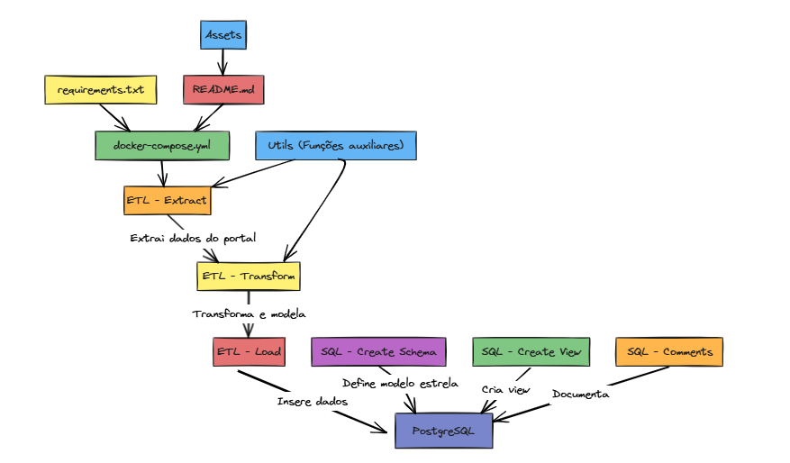

# Data Mart de Índice de Desempenho no Atendimento (IDA)

Este projeto foi desenvolvido como parte de um **case técnico** para a vaga de **Engenheiro de Dados Júnior**.  
O objetivo é criar um **Data Mart** com base nos dados públicos do portal de **Dados Abertos** referente aos serviços de:

- Telefonia Celular (Serviço Móvel Pessoal – SMP)
- Telefonia Fixa Local (Serviço Telefônico Fixo Comutado – STFC)
- Banda Larga Fixa (Serviço de Comunicação Multimídia – SCM)

## Diagrama de Aividades:



## Objetivo do Projeto

O desafio consiste em:

1. **Extrair** dados brutos do portal de Dados Abertos.
2. **Transformar** e organizar esses dados em um **modelo estrela** (Data Mart) no **PostgreSQL**.
3. Criar uma **view** calculando:
   - **Taxa de variação** mensal da “Taxa de Resolvidas em 5 dias úteis”.
   - Diferença entre a taxa de variação média e a taxa individual de cada grupo econômico (pivotando grupos como colunas).
4. Disponibilizar a solução em **container Docker** via **Docker Compose**.


## 📂 Estrutura do Projeto


```plaintext
├── docker-compose.yml       # Orquestração dos containers
├── etl/
│   ├── extract.py            # Extração dos dados do portal
│   ├── transform.py          # Tratamento e modelagem dos dados
│   ├── load.py               # Inserção no PostgreSQL
│   └── utils/                # Funções auxiliares e configuração
├── sql/
│   ├── create_schema.sql     # Criação do modelo estrela (Data Mart)
│   ├── create_view.sql       # Criação da view solicitada
│   └── comments.sql          # Documentação com COMMENT ON
├── requirements.txt          # Dependências Python
├── README.md                 # Documentação do projeto
└── assets/
    └── workflow.png          # Infográfico do fluxo do processo